# WorkSphere Desktop Installation Guide (Windows and macOS)

---

**Version:** 1.0 | **Last Updated:** March 2, 2026

## 1. Introduction

### 1.1 Purpose

This guide shows you how to install, verify, and uninstall WorkSphere Desktop on Windows and macOS.

### 1.2 Scope

This guide covers:

- System requirements  
- Installation procedures  
- Verification procedures
- Uninstallation procedures

### 1.3 Intended Audience

This guide is intended for: 

- End-users 
- IT support teams
- System administrators

> **Disclaimer:** WorkSphere Desktop is a fictional product created for technical writing portfolio purposes.

---

## 2. Overview

WorkSphere Desktop is a project management and team collaboration app that helps teams organize tasks, track progress, manage workflows, and sync in real time on Windows and macOS.

## 3. System Requirements

Before you begin, ensure the following requirements are met:

### 3.1 Software Requirements

- Windows 10 or later
- macOS 12 or later
- Installer size: Approximately 120 MB
- Administrator privileges may be required during installation

### 3.2 Hardware Requirements

#### Windows

- Minimum 4 GB of RAM  
- Intel Core i3 (8th generation or later) or AMD Ryzen 3 or equivalent
- 2.0 GHz dual-core processor or better
- 500 MB available disk space
- 64-bit systems only

#### macOS

- Minimum 4 GB of RAM
- Apple Silicon (M1 or later) or Intel Core i5 or equivalent
- 2.0 GHz dual-core processor or better
- 500 MB available disk space

## 4. Pre-Installation Checklist

Ensure the following conditions are met before installation:

- A stable internet connection
- Meet the system requirements listed above

---

## 5. Procedure

### 5.1 Download the WorkSphere Desktop app Installer

1. Open a web browser  

2. Go to the WorkSphere Download page: https://www.worksphereapp.com/download

&nbsp;&nbsp;&nbsp;&nbsp;&nbsp;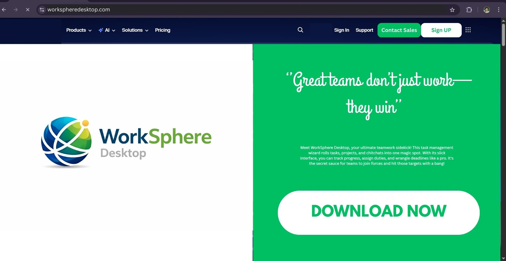

3. Click **Download Now**

&nbsp;&nbsp;&nbsp;&nbsp;&nbsp;

4. Select the type of **installer file** according to your system:

- **Download WorkSphere Desktop for Windows** to download the installer file for Windows

&nbsp;&nbsp;&nbsp;&nbsp;&nbsp;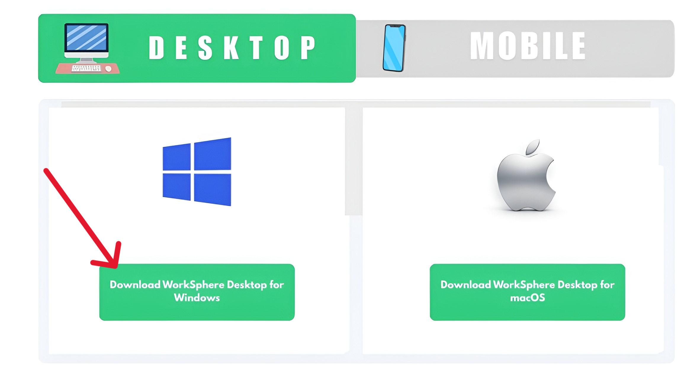

- **Download WorkSphere Desktop for macOS** to download the installer file for macOS.

&nbsp;&nbsp;&nbsp;&nbsp;&nbsp;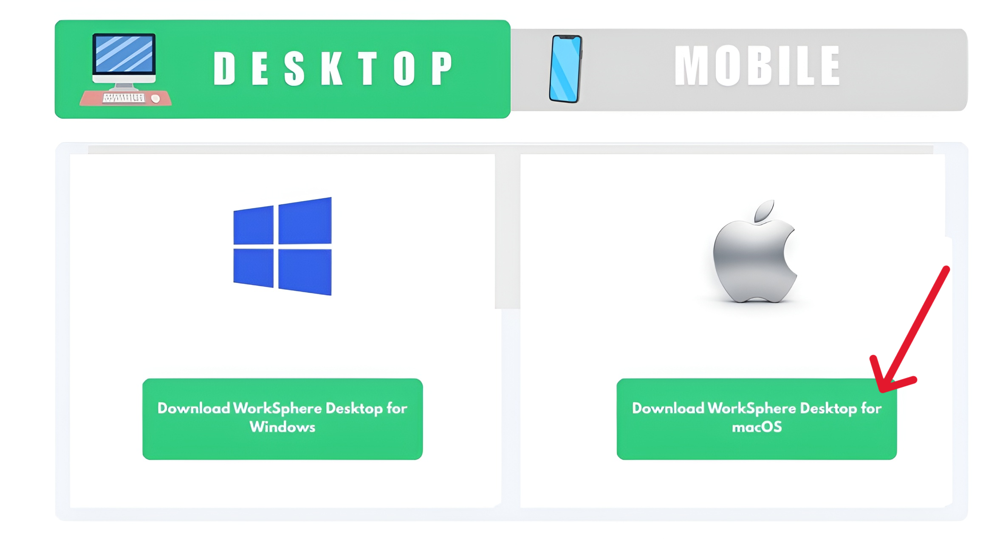

5. Wait for the **installer file** to download.

**Expected result:** The WorkSphere Desktop app installer is downloaded.

### 5.2 Install the WorkSphere Desktop app

1. Open the **Downloads folder**

2. Double-click the **installer file**:  
 
- In Windows, it will be: `WorkSphere_setup.exe`

&nbsp;&nbsp;&nbsp;&nbsp;&nbsp;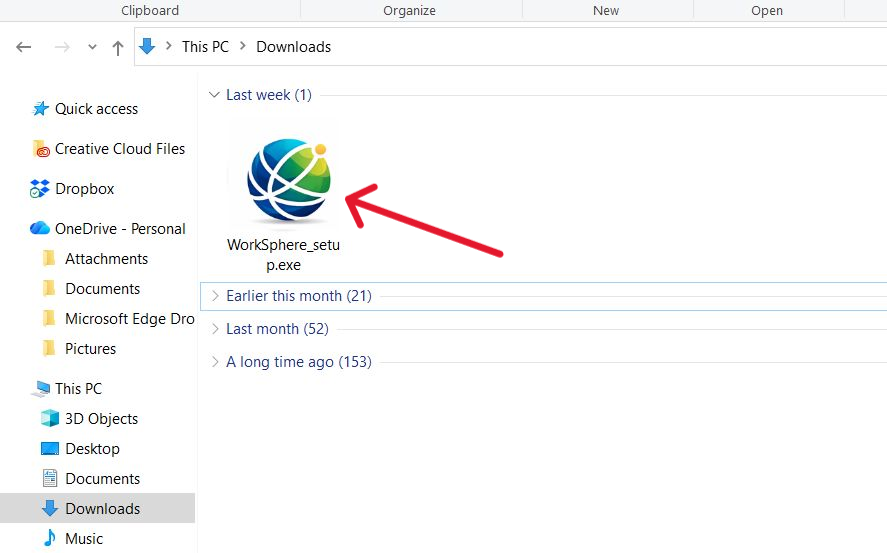

- In macOS, it will be: `WorkSphere_macOS.dmg`

&nbsp;&nbsp;&nbsp;&nbsp;&nbsp;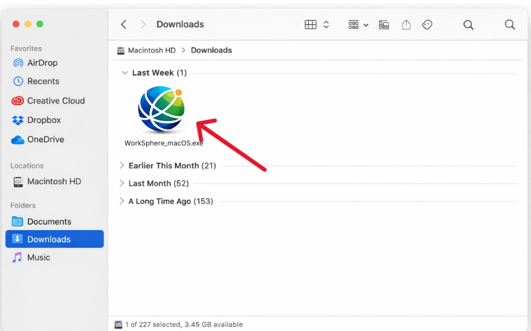

3. Do the following to complete the installation:

- On Windows: click **Install**  

&nbsp;&nbsp;&nbsp;&nbsp;&nbsp;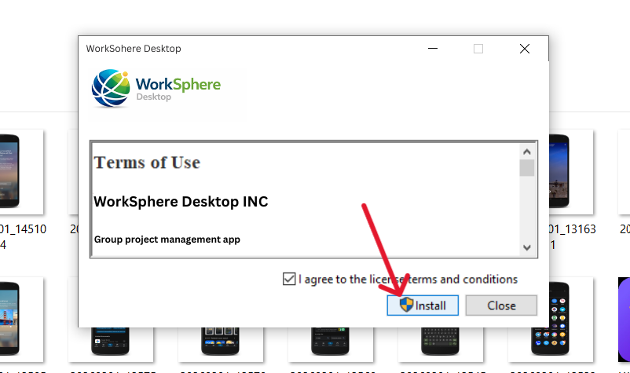

- On macOS: **Drag the app to the Applications folder**

&nbsp;&nbsp;&nbsp;&nbsp;&nbsp;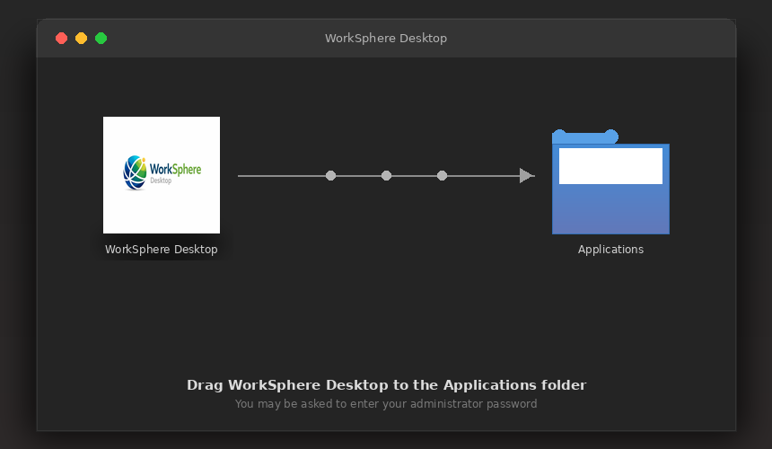

**Expected result:** The WorkSphere Desktop app is installed.

---

## 6. Post-Installation Verification

Follow the steps to confirm the installation.

### Windows

1. Open **Start Menu** > Search **WorkSphere Desktop**

&nbsp;&nbsp;&nbsp;&nbsp;&nbsp;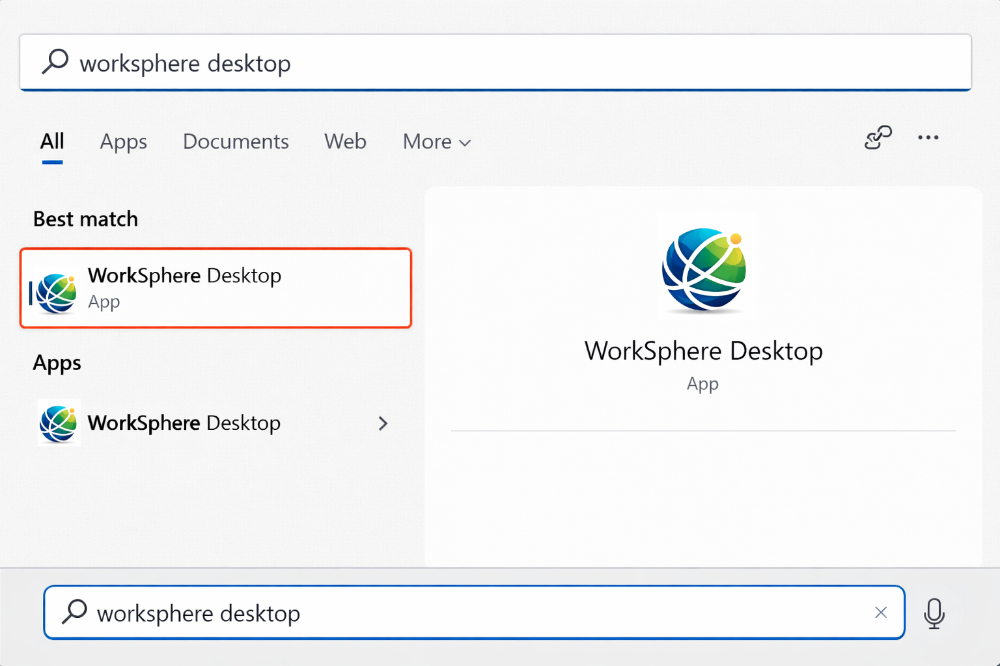

2. Click **WorkSphere Desktop app icon**

&nbsp;&nbsp;&nbsp;&nbsp;&nbsp;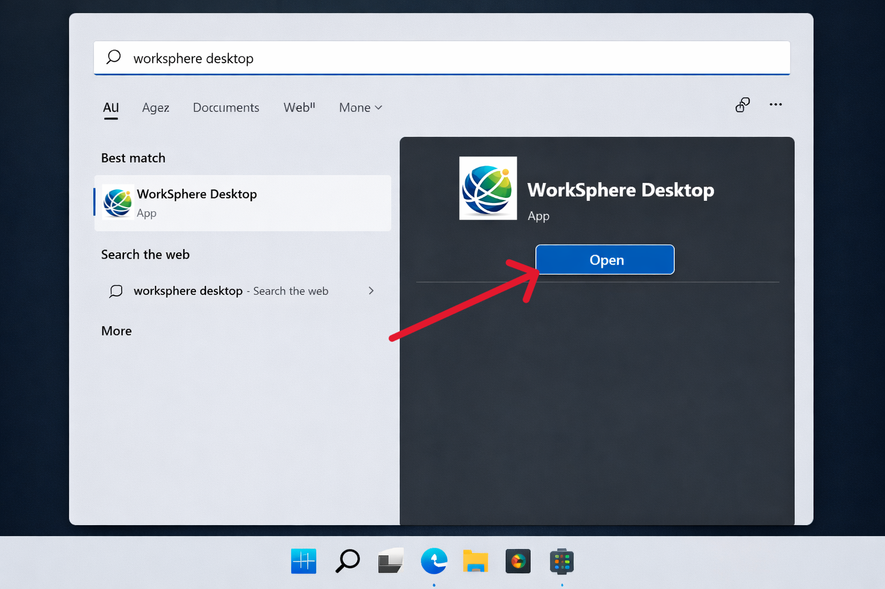

3. Verify that the application launches without error messages.

&nbsp;&nbsp;&nbsp;&nbsp;&nbsp;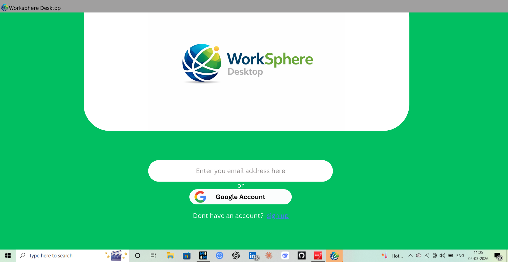

### macOS

1. Open **Launchpad** > Type **WorkSphere Desktop** in the search bar

&nbsp;&nbsp;&nbsp;&nbsp;&nbsp;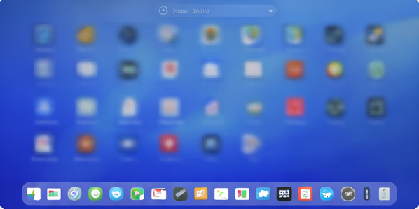

2.  Click **WorkSphere Desktop app icon**

&nbsp;&nbsp;&nbsp;&nbsp;&nbsp;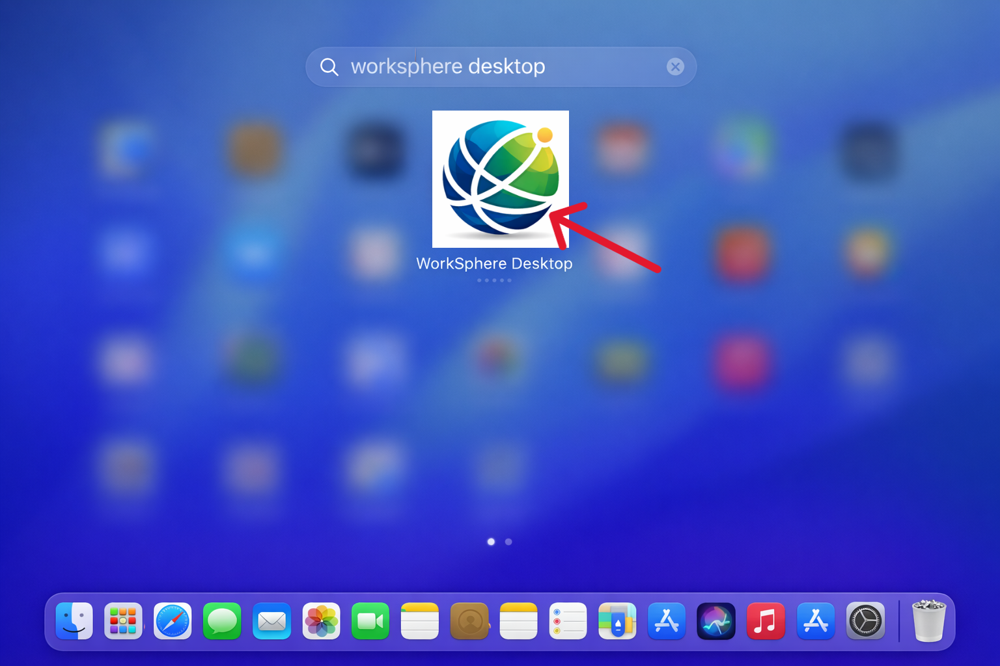

3. Confirm the app launches without any errors.

&nbsp;&nbsp;&nbsp;&nbsp;&nbsp;

## 7. Uninstall the WorkSphere Desktop app

### Windows

1. Open the **Start Menu** > **Apps** > **Apps and Features** (this step may vary slightly according to the Windows version)

&nbsp;&nbsp;&nbsp;&nbsp;&nbsp;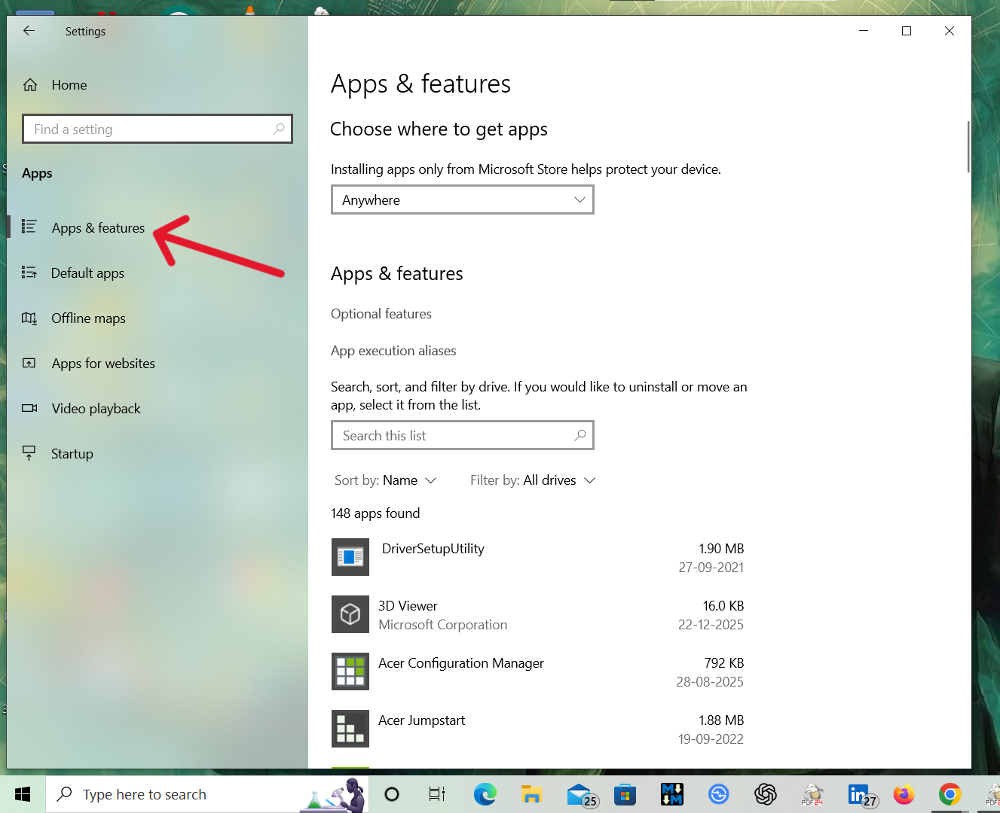

2. Search **WorkSphere Desktop** > click on the **app icon**

&nbsp;&nbsp;&nbsp;&nbsp;&nbsp;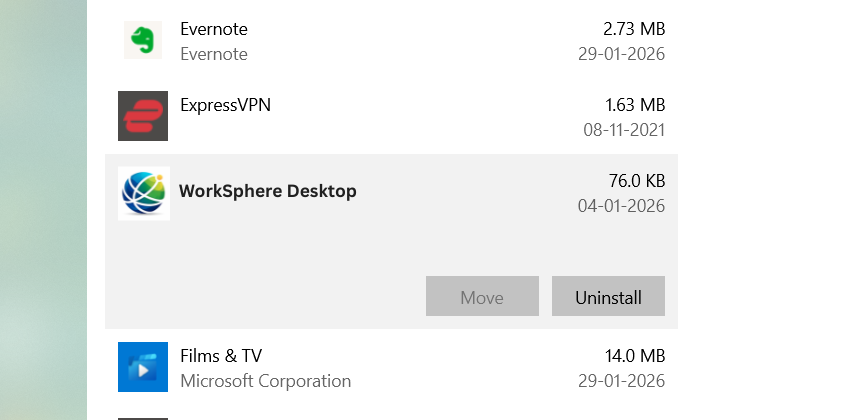

3. Click **Uninstall**

&nbsp;&nbsp;&nbsp;&nbsp;&nbsp;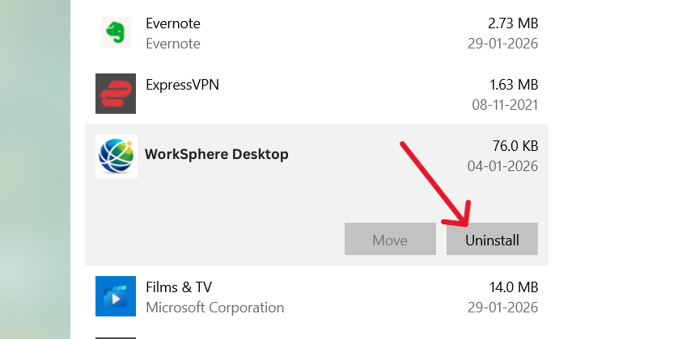

**Result:** The WorkSphere Desktop app is uninstalled on Windows.

### macOS

1. Open **Finder**

&nbsp;&nbsp;&nbsp;&nbsp;&nbsp;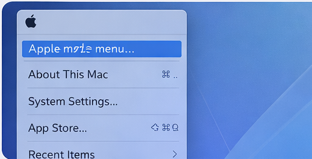

2. Go to **Applications**

&nbsp;&nbsp;&nbsp;&nbsp;&nbsp;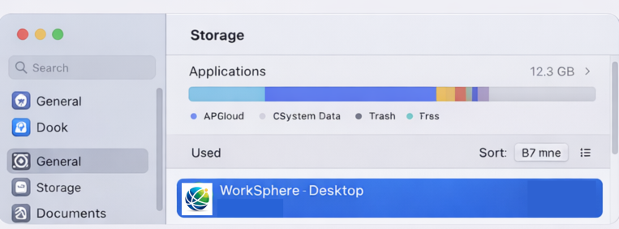

3. Drag app to **Trash**

&nbsp;&nbsp;&nbsp;&nbsp;&nbsp;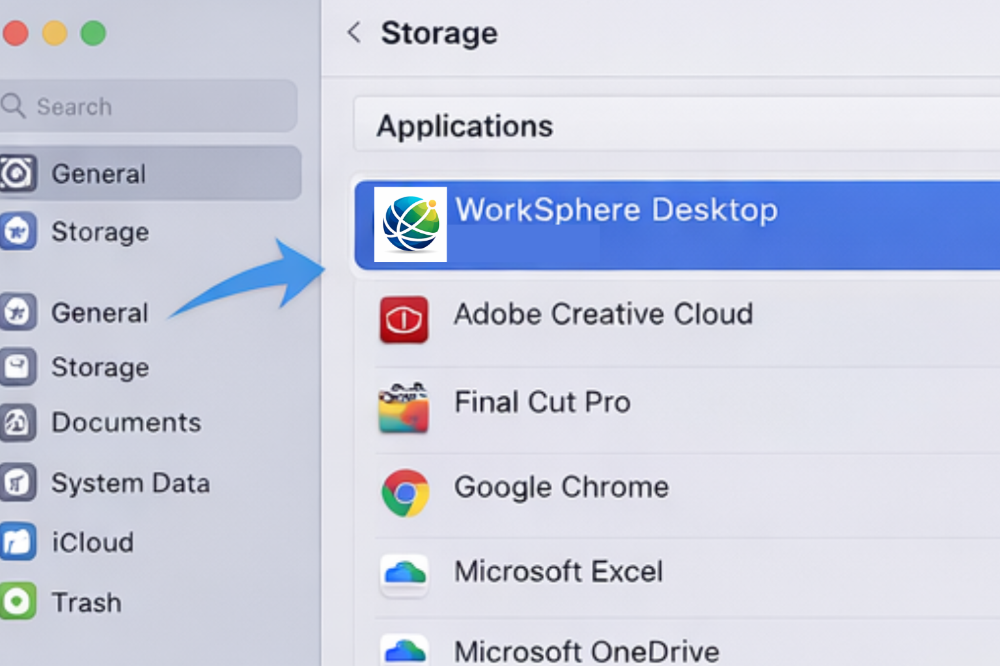

**Result:** The WorkSphere Desktop app is uninstalled on macOS.

---

## 8. Troubleshooting

### Problem 1: Website loading fails

#### Cause

- Network connectivity issue  
- DNS resolution failure

#### Solution

##### Windows

1. Open **Start Menu** > **Settings** > **Network & Internet**  
2. Verify that the system has a stable internet connection
3. Reopen the **WorkSphere Desktop website**

#### macOS

1. Click **Apple menu** > choose **System Settings**  
2. Select **Network**  
3. Verify that the system has a stable internet connection. 
4. Reopen the **WorkSphere Desktop website**.

### Problem 2: Unable to uninstall the app

#### Cause

- App running in the background

#### Solution

1. Do the following:  
- On Windows: check the **Task bar**  
- On macOS: check the **Dock**
2. Close **WorkSphere Desktop app** running in the background.  
3. Restart the uninstalling procedure.

## 9. Additional Support Information

For more help, contact:

- Email: support@worksphere.com 
- Help Center on the official WorkSphere Desktop app website.

## 10. License and Compliance

WorkSphere Desktop is licensed under the WorkSphere End-User License Agreement (EULA). Users must comply with the license terms and applicable data protection regulations.

---
---
