# Visual Studio Code User Guide

---

| **FIELD** | **DETAILS** |
|-----------|-------------|
| Product | Visual Studio Code (VS Code) |
| Document Type | User Guide |
| OS/Platform | Windows |
| Version | 1.109.5 |
| Author | Gokul S Anand |
| Last Updated | March 3, 2026 |

## Introduction

Visual Studio Code (VS Code) is a code editor developed by Microsoft. This guide helps users navigate the VS Code interface, including the Explorer, Extensions, Terminal, and Debug features on Windows.

## How to Use This Guide

Read this guide from top to bottom if you are a beginner. If you are looking for a specific feature, use Ctrl+F to search by keyword or jump to the relevant section using the Table of Contents.

## Prerequisites

Before you begin, ensure the following requirements are met:

- [ ]  Windows 10 or later

- [ ] Minimum 4GB RAM

- [ ] ARM64 or x64 processor; Quad-core or better

- [ ] 850 MB of disk space

- [ ] Display resolution of 1366 x 768 or higher

- [ ] VS Code is installed on your device.  
Download: <https://code.visualstudio.com/download>

---

## Getting Started

### Step 1: Launch the VS Code App

Double-click the VS Code icon on your desktop or search "Visual Studio Code" in the Start menu.

&nbsp;&nbsp;&nbsp;&nbsp;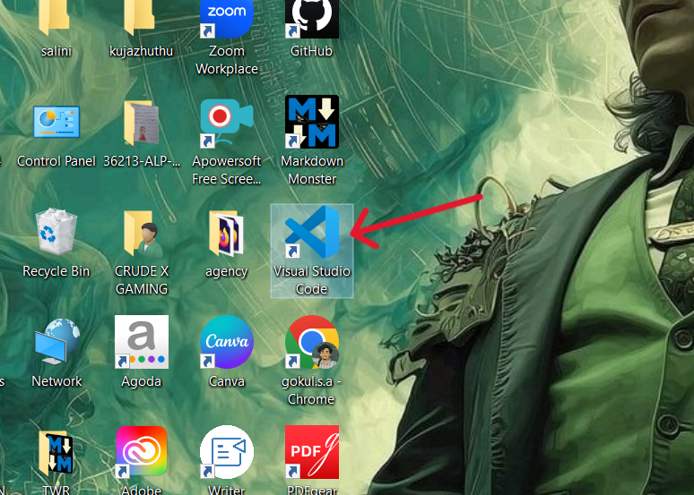

### Step 2: Explore the Welcome Screen

Go through the basic customization options and tutorials that appear on the Welcome tab, which is the first screen after launching the app.

&nbsp;&nbsp;&nbsp;&nbsp;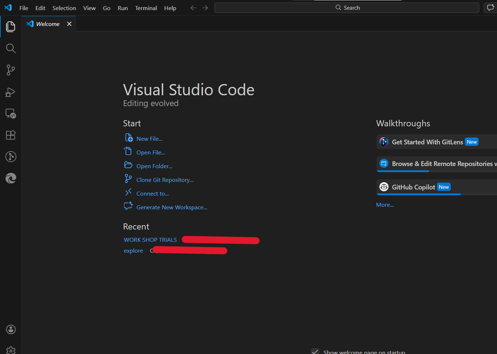

### Step 3: Understand the Interface

There are 6 main icons on the left sidebar:

- **Explorer** - Browse, open, and manage your project files and folders.

&nbsp;&nbsp;&nbsp;&nbsp;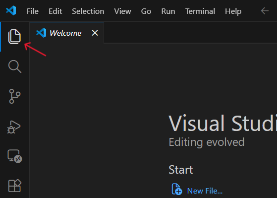

- **Search** - Find and replace text across all files in your project.

&nbsp;&nbsp;&nbsp;&nbsp;

- **Source Control** - Track code changes and manage version control using Git.

&nbsp;&nbsp;&nbsp;&nbsp;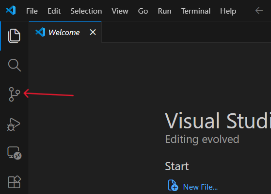

- **Run and Debug** - Run your code and identify errors using the built-in debugger.

&nbsp;&nbsp;&nbsp;&nbsp;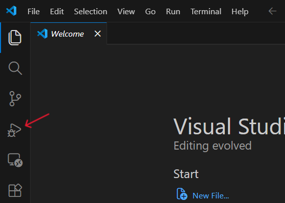

- **Remote Explorer** - Connect to remote servers, containers, or cloud environments.

&nbsp;&nbsp;&nbsp;&nbsp;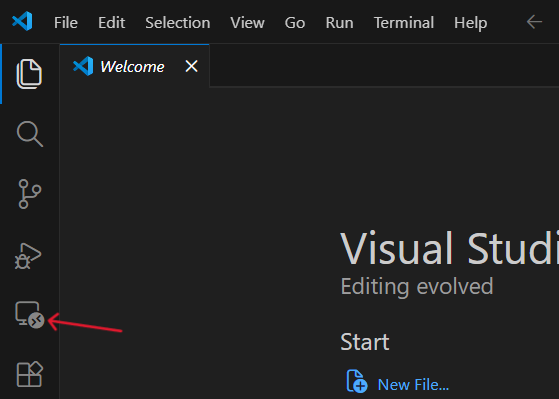

- **Extensions** - Browse and install additional tools from the VS Code marketplace.

&nbsp;&nbsp;&nbsp;&nbsp;

> 💡 **Tip:** Changing the color theme to dark is easier on the eyes during long coding sessions.

> ⚠️ **Warning:** Opening an untrusted file or folder may cause security issues. Only open files and folders from sources you trust.

---

## Key Features

### Feature 1: Integrated Terminal

The Integrated Terminal allows users to run commands directly within VS Code without switching to an external application.

### Feature 2: IntelliSense

IntelliSense automatically suggests code completions as users type, eliminating the need to memorize syntax or commands.

### Feature 3: Extensions Marketplace

Extensions Marketplace allows users to install additional tools and add-ons directly within VS Code, eliminating the need to access them externally.

### Feature 4: Git Integration

Git Integration allows users to track code changes, commit, and manage version control directly within VS Code without switching to an external application.

---

## Common Tasks

### Task 1: Creating a New File

**Steps:**

1. Click **File** in the top menu bar.

&nbsp;&nbsp;&nbsp;&nbsp;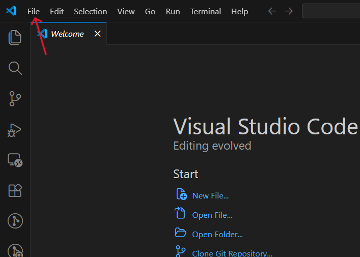

2. Click **New Text File** (**Ctrl+N**)

&nbsp;&nbsp;&nbsp;&nbsp;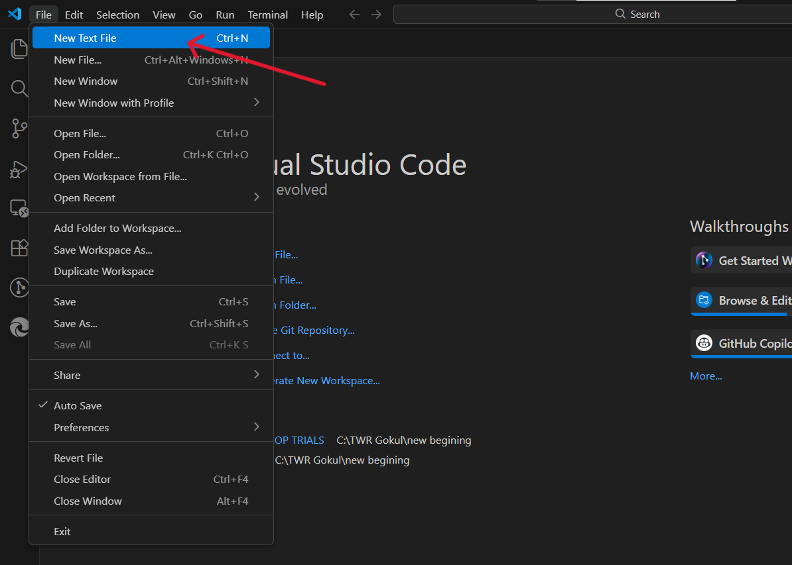

3. Click **File** > **Save As** (**Ctrl+Shift+S**) to name and save the file.

&nbsp;&nbsp;&nbsp;&nbsp;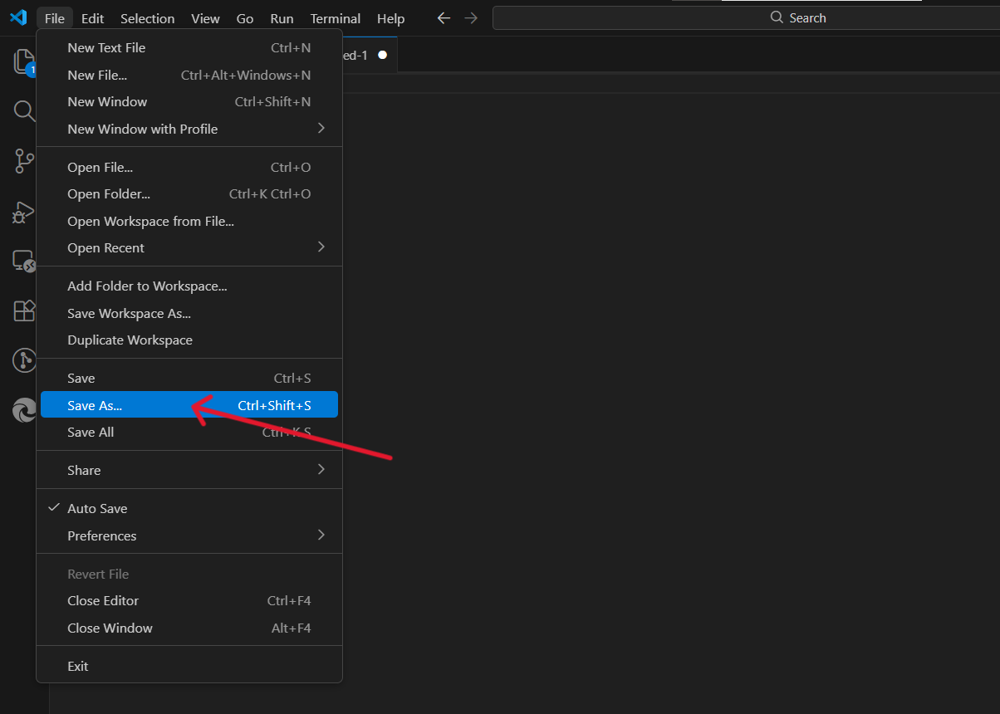

4. Choose your file location and enter a file name.

&nbsp;&nbsp;&nbsp;&nbsp;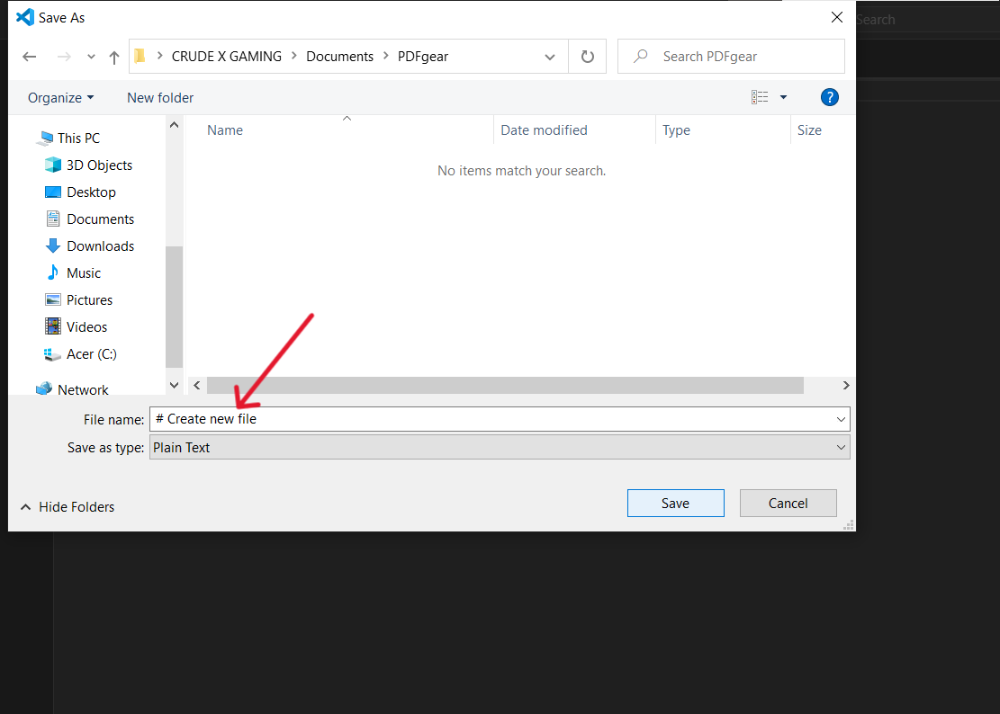

5. Click **Save**

&nbsp;&nbsp;&nbsp;&nbsp;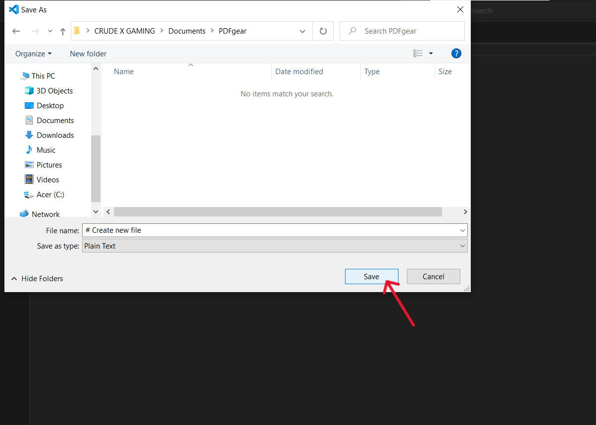

**Expected Result:** A new file is created.

### Task 2: Changing the color theme

**Steps:**

1.  Click the **Settings icon** in the bottom left corner of the screen.

&nbsp;&nbsp;&nbsp;&nbsp;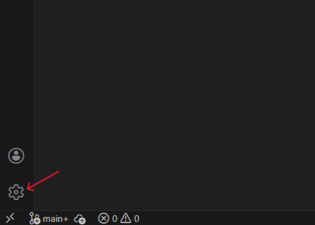
 
2. Choose **Themes** > **Color Theme** (**Ctrl+K Ctrl+T**)

&nbsp;&nbsp;&nbsp;&nbsp;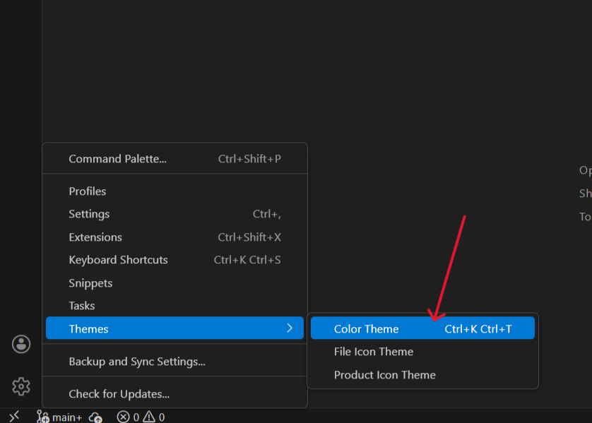
 
3. Select the color theme you prefer from the list of options.

&nbsp;&nbsp;&nbsp;&nbsp;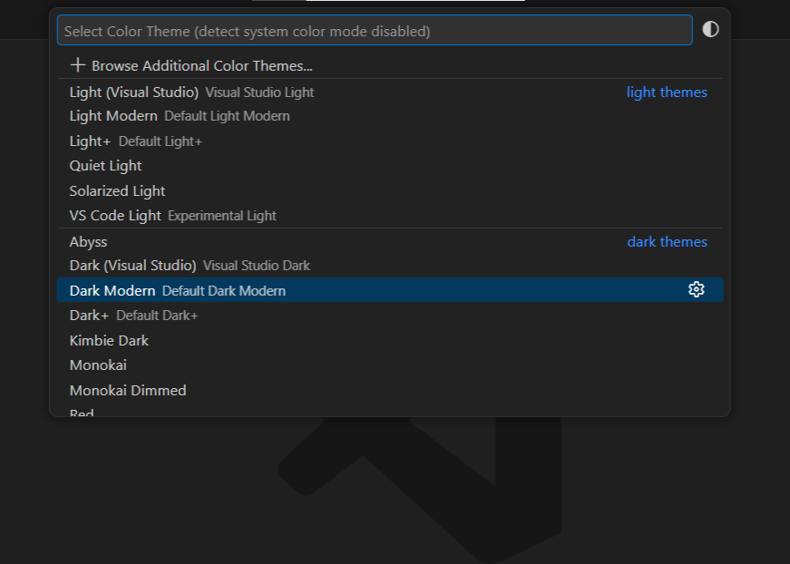

**Expected Result:** The VS Code interface changes to the selected color theme immediately.

### Task 3: Changing the font size

**Steps:**

1. Click on the **Settings icon** > **Settings** (**Ctrl+,**)

&nbsp;&nbsp;&nbsp;&nbsp;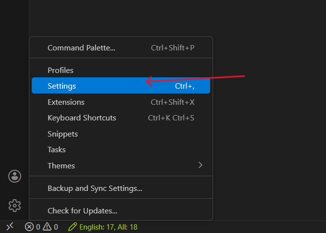
 
2. Select **Text Editor** > **Font**

&nbsp;&nbsp;&nbsp;&nbsp;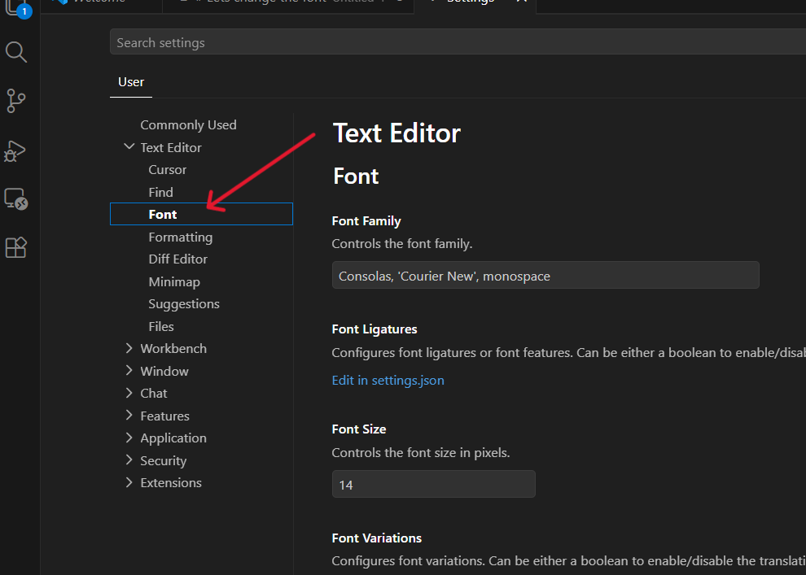
 
3. Enter your preferred font size in the **Font Size** field.

&nbsp;&nbsp;&nbsp;&nbsp;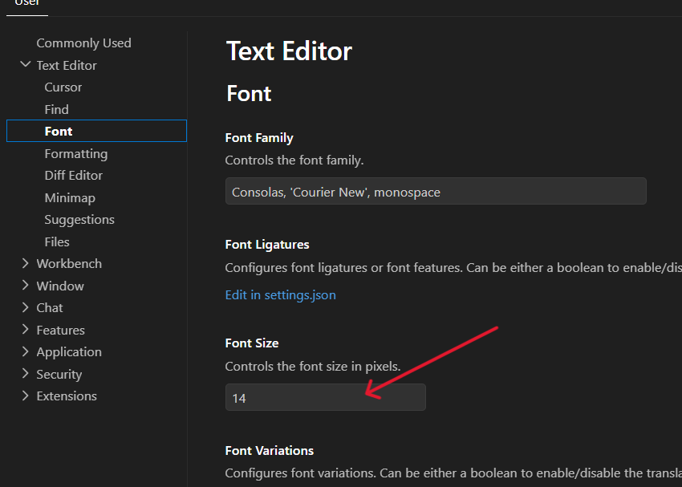

**Expected Result:** The font size updates immediately across the editor.

### Task 4: Enabling Auto Save

**Steps:**

1. Click **File** in the top menu bar.

&nbsp;&nbsp;&nbsp;&nbsp;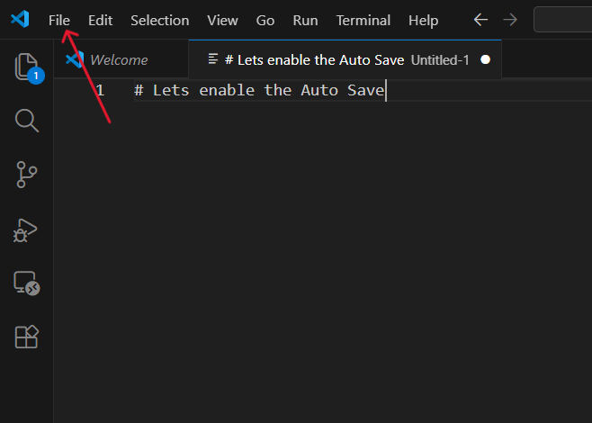
 
2. Click **Auto Save** to enable it.

&nbsp;&nbsp;&nbsp;&nbsp;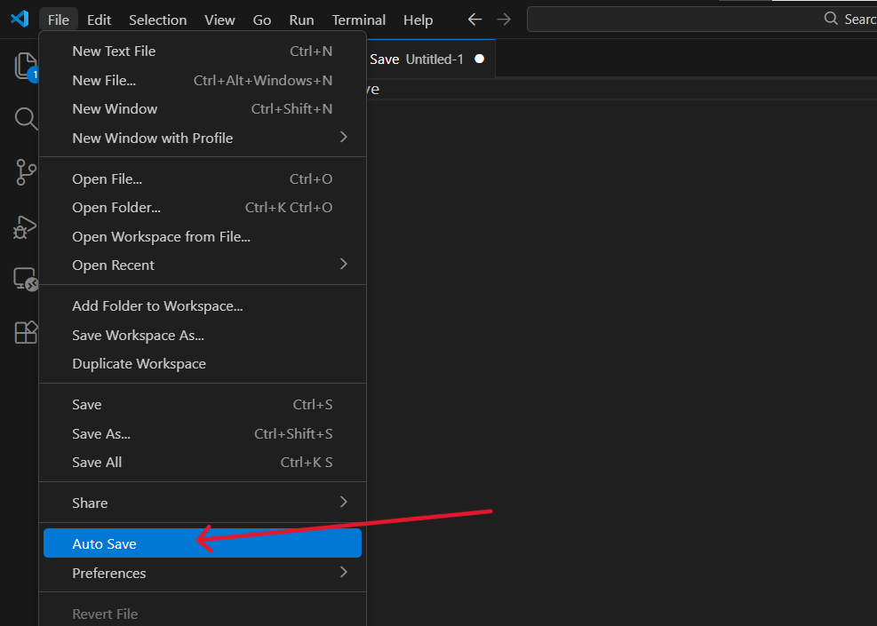
 
**Expected Result:** Auto Save is enabled. VS Code now saves files automatically without manual saving.

### Task 5: Installing an Extension

**Steps:**

1. Click **Extensions** (**Ctrl+Shift+X**) on the sidebar.

&nbsp;&nbsp;&nbsp;&nbsp;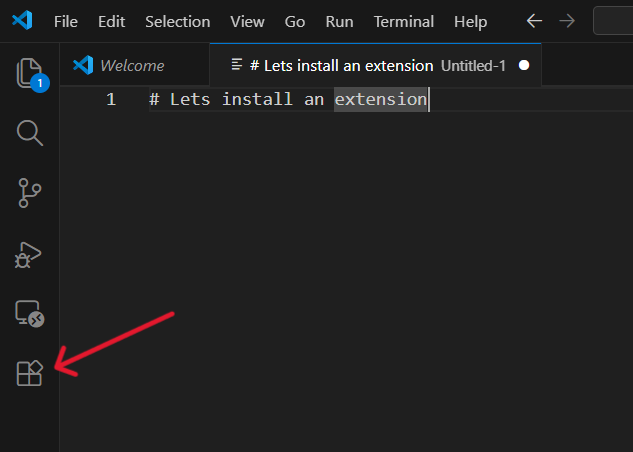

2. Choose or search for the extensions you want; click on the **icon of the extensions** you prefer

&nbsp;&nbsp;&nbsp;&nbsp;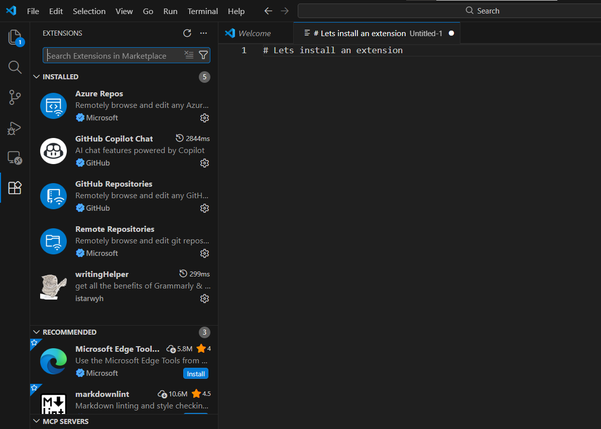

3. Click **Install** and wait for it to get completed.

&nbsp;&nbsp;&nbsp;&nbsp;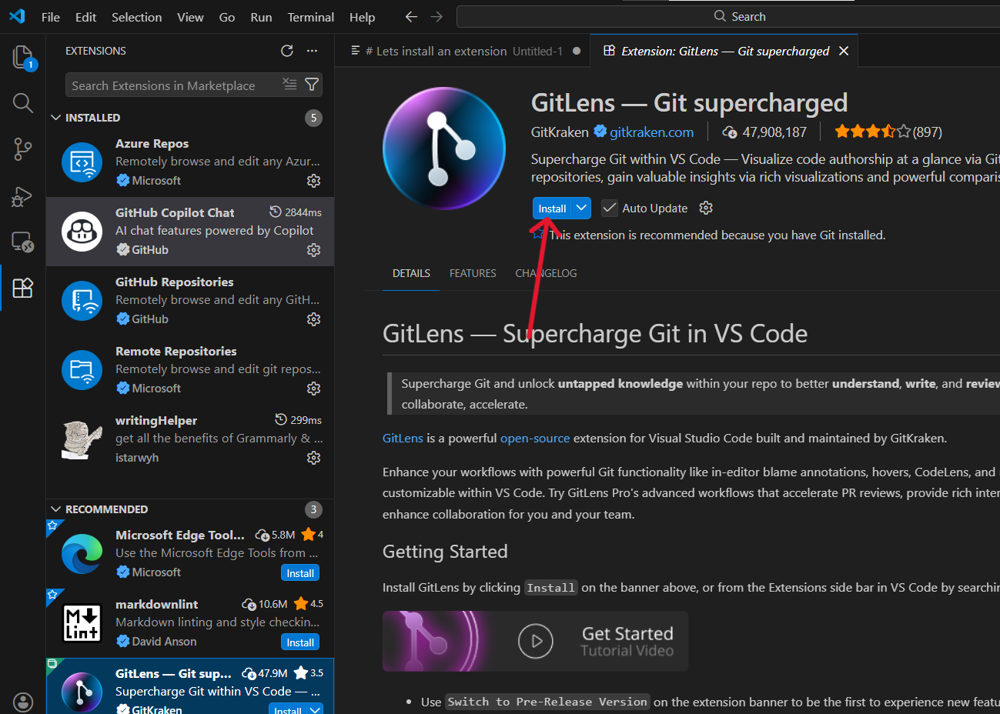

**Expected Result:** Extension is installed and is ready to use.

### Task 6: Opening the Terminal

**Steps:**

1. Click **Terminal** on the top menu.

&nbsp;&nbsp;&nbsp;&nbsp;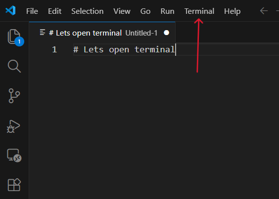

2. Choose **New Terminal** (**Ctrl+Shift+\`**)

&nbsp;&nbsp;&nbsp;&nbsp;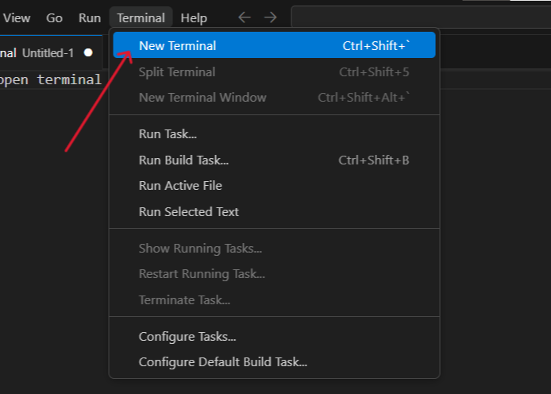

**Expected Result:** A new terminal opens without any errors.

---

## Troubleshooting

### Issue 1: Installation fails

**Cause:**

- The system doesn't have enough storage for the installation.

- Corrupted installer file

- The system doesn't have the minimum requirements to complete the installation.

**Fix:**

1. Ensure that your system has sufficient storage for the installation. If not, remove unnecessary files.

2. Verify that your system meets the minimum requirements to run the app.

3. Download the latest setup file from the official page of VS Code.

4. Attempt the action of installing it again.

5. Download the VS Code Zip Archive and run it if the step above fails.

**Expected Result:** Visual Studio Code is installed successfully without any errors.

### Issue 2: Extensions Not Installing

**Cause:**

- Unstable internet connection

- Extensions permission denied

- Outdated Version of VS Code

- Insufficient space

**Fix:**

1. Ensure that your system has a stable internet connection.
 
2. Click on the **Settings icon** > **Settings** (**Ctrl+,**) > **Extension Settings**; make sure the type of extension you prefer to install is allowed. If not, allow it.

3. Update VS Code by clicking **Help** > **Check for Updates** and installing any available updates.
 
4. Ensure that your system has sufficient storage for the installation.
 
5. Retry the attempt to install the extension.

**Expected Result:** Extension is installed successfully without any errors.

### Issue 3: Terminal Not Opening

**Cause:**

- No workspace or folder open
- Newly installed/updated extensions are blocking.
- Corrupted Terminal settings

**Fix:**

1. Ensure you have created a workspace or folder. If not, create one.

2. Check whether any newly installed or updated extension is blocking. If yes, uninstall those extensions.

3. Reset the Terminal settings by pressing **Ctrl+Shift+P**, typing **Reset Settings**, and pressing **Enter** to restore default settings.

**Expected Result:** Terminal opens successfully without any errors.

## FAQ

**Q1: What is VS Code?**

**A:** Visual Studio Code (VS Code) is a code editor 
made by Microsoft. It offers features like the Integrated Terminal, IntelliSense, Extensions Marketplace, and Git Integration.

**Q2: Which Operating Systems (OS) support VS Code?**

**A:** The following OSs support VS Code:

- Windows 10 or later (64-bit)

- macOS: macOS 10.15 or later

- Linux: Ubuntu 20.04 or later, Debian 10 or later, Red Hat Enterprise Linux 8 or later, Fedora 36 or later

**Q3: Does VS Code need an internet connection?**

**A:** VS Code requires an internet connection for features like installing extensions, automatic updates, and Git integration. Core editing works offline.

**Q4: What is IntelliSense?**

**A:** IntelliSense is a built-in feature in VS Code which suggests code completions as you type. This helps you write code faster, eliminating the need to memorize every command or syntax.

**Q5: Why does the app get closed in the middle of use?**

**A:** This issue may occur due to an outdated version; to resolve it, do the following:

1. Click **Help** at the top of your screen.

2. Select **Check for Updates**

3. If there is an update available, do it.

## Support & Contact

|**Channel**|**Details**|
|-----------|-----------|
| Official Docs | https://code.visualstudio.com/docs#vscode |
| Community Forum | https://github.com/microsoft/vscode/discussions |
| Stack Overflow | https://stackoverflow.com/questions/tagged/vscode |
| Report an Issue |	https://github.com/microsoft/vscode/issues |

## License & Compliance

This document was created for portfolio and educational purposes only.

Visual Studio Code is developed and maintained by Microsoft Corporation. All trademarks, logos, and product names belong to Microsoft Corporation.

VS Code is licensed under the MIT License.  
License details: <https://github.com/microsoft/vscode/blob/main/LICENSE.txt>

All product information in this guide is based on VS Code Version 1.109.5 for Windows.

This document is not affiliated with or endorsed by Microsoft Corporation.

---
---
_Document Version: 1.0 | Last Reviewed: \[March 9, 2026\]_
