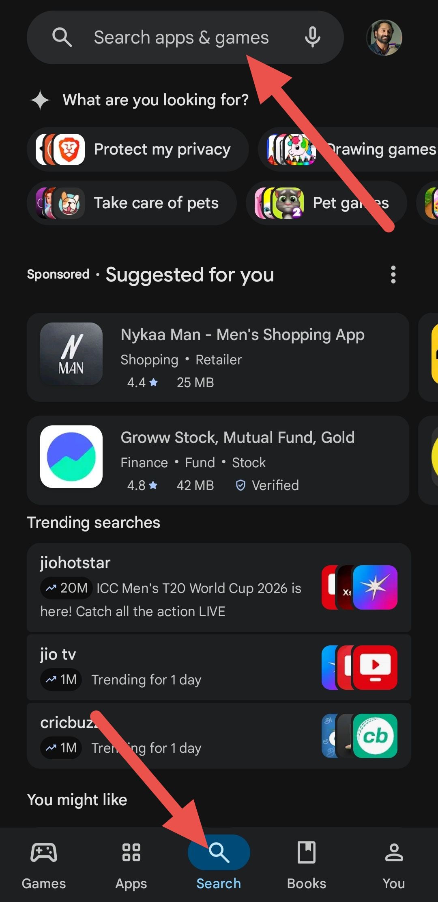
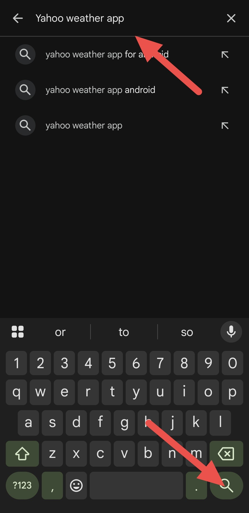
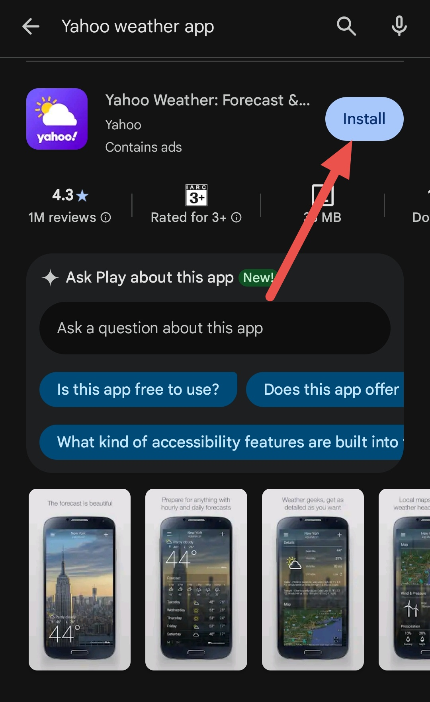
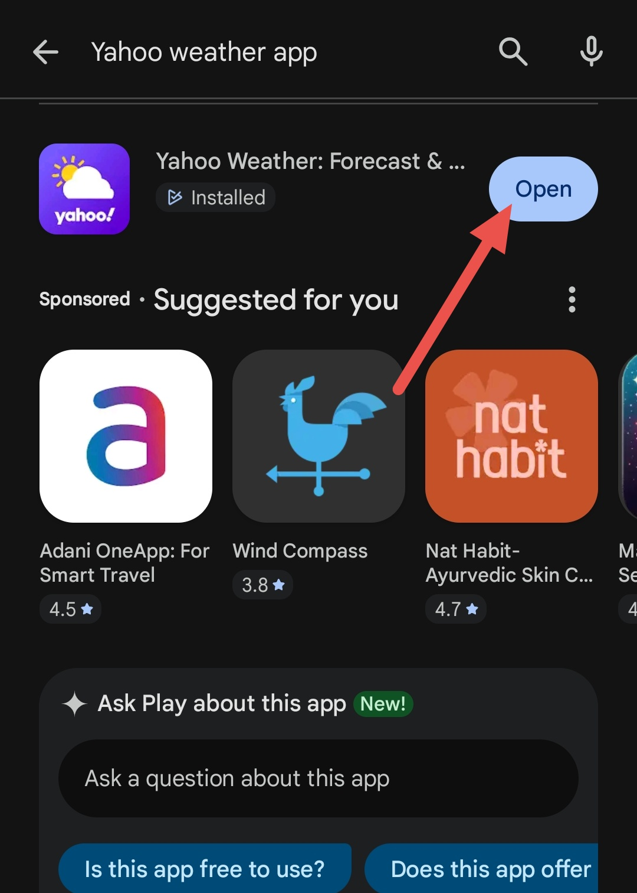

# Yahoo Weather App User Guide

---
                                                       
|**FIELD**|**DETAILS**|
|---------|---------- |
| Product | Yahoo Weather App |
| Document Type | User guide |
| OS/Platform | Android and iOS |
| Version | Android: 1.63.0, iOS: 2.24.7 |
| Author | Gokul S Anand |
| Last Updated | Android: December 12, 2025, iOS: January 29, 2026 |

## Purpose

This guide provides instructions for using the Yahoo Weather app with maximum efficiency.

## Intended Audience

This guide is intended for:

- End users with basic mobile knowledge
- IT Support teams

---

## 1. Overview

Yahoo Weather is a free mobile app that provides real-time updates, hourly and daily forecasts, interactive maps, and weather alerts to help users plan their day.

## 2. Scope

These steps for the Yahoo Weather app apply to the following mobile platforms:

* Android  
* iOS

**Note:** The steps and elements may differ in minor ways based on the system.

## 3. Prerequisites

Before you begin, ensure the following requirements are met:

### 3.1 On Android

- Android 7.0 or later
- Minimum of 150 MB of free storage space  
- Stable internet connection

### 3.2 On iOS

- iOS 15.0 or later
- Minimum of 150 MB of free storage space 
- Stable internet connection

## 4. Key Features

- Real-time weather with hourly, 5-day, and 10-day forecasts  
- Interactive radar, satellite, and weather maps
- Beautiful, dynamic photos that match your location and weather  
- Custom alerts and notifications for daily and severe weather
- Support for saving and switching between many locations

---

## 5. Procedure: Using the Yahoo Weather App

### 5.1 Installing the App

- On Android  
1. Open the **Google Play Store**

2. Tap the **Search icon** at the bottom or the **Search bar** at the top

&nbsp;&nbsp;&nbsp;&nbsp;&nbsp;

3. Enter the name of the app > Press **Search**

&nbsp;&nbsp;&nbsp;&nbsp;&nbsp;

4. Tap **Install** to begin the installation process

&nbsp;&nbsp;&nbsp;&nbsp;&nbsp;

5. Tap **Open** to launch the app.

&nbsp;&nbsp;&nbsp;&nbsp;&nbsp;

**Result:** The app was installed on Android , now users can get access to the app's feature's.

* On iOS  
1. Open the **App Store** on your iPhone or iPad

2. Tap the **Search** icon at the bottom

&nbsp;&nbsp;&nbsp;&nbsp;&nbsp;

3. Enter the app name in the **search field** and press **Search**

&nbsp;&nbsp;&nbsp;&nbsp;&nbsp;

4. Find the app in the results and tap **Get** (or the cloud download icon)

&nbsp;&nbsp;&nbsp;&nbsp;&nbsp;

5. Tap **Open** to launch the app

&nbsp;&nbsp;&nbsp;&nbsp;&nbsp;

**Result:** The app was installed on iOS for users, now users can get access to then app's feature's.

### 5.2 Launching the App

1. Tap on the **app icon**

&nbsp;&nbsp;&nbsp;&nbsp;&nbsp;

2. Select the locations for which you want to see the weather details > tap **Continue**

&nbsp;&nbsp;&nbsp;&nbsp;&nbsp;

3. Enable **Location permission**

&nbsp;&nbsp;&nbsp;&nbsp;&nbsp;

4. Tap **Enable notifications** to get the latest weather updates (or you can skip by tapping **No, thanks**)

&nbsp;&nbsp;&nbsp;&nbsp;&nbsp;

**Result:** The app launched successfully.

### 5.3 Create an Account

**Note:** From step 3 onward, screenshots are not included because screens may differ by account and region.

1. Tap **Menu** in the top-left corner

&nbsp;&nbsp;&nbsp;&nbsp;&nbsp;

2. Select **Sign in / Sign up**

&nbsp;&nbsp;&nbsp;&nbsp;&nbsp;

3. Tap **Create account**

&nbsp;&nbsp;&nbsp;&nbsp;&nbsp;

4. Fill in the requested details for the creation of the account (You can also sign up through email)

&nbsp;&nbsp;&nbsp;&nbsp;&nbsp;

5. Enter the phone number to which you want to receive the **verification code**

&nbsp;&nbsp;&nbsp;&nbsp;&nbsp;

6. Select the way you want to receive the verification code:  
- By text
- By WhatsApp message

7. Enter the code to complete the account creation process

**Result:** The account has been created for use.

### 5.4 Selecting the Location for Weather Details

1. Tap the **Add (+) icon**

&nbsp;&nbsp;&nbsp;&nbsp;&nbsp;

2. Enter the city name or its ZIP code for which you want to know the weather details > tap on the **Name of the city**

&nbsp;&nbsp;&nbsp;&nbsp;&nbsp;

**Result:** Location added without any issues. 

### 5.5 Weather Details

Once you add the location, the app's home screen shows the current weather there. To view more details:

1. Scroll down to see the weather forecast and details.

&nbsp;&nbsp;&nbsp;&nbsp;&nbsp;

2. Continue scrolling to see the **map of the location**, **its wind**, and **pressure details**.

&nbsp;&nbsp;&nbsp;&nbsp;&nbsp;

3. Scroll again to see the **details of precipitation** and the **locations of the sun and moon**.

&nbsp;&nbsp;&nbsp;&nbsp;&nbsp;

**Result:** The weather details are displayed for the selected location.

---

## 6. Troubleshooting

**Problem 1:** Account sign-in failed  
**Cause:** Error in details  

**Solution:**

1. Tap **Menu** > **Sign in / Sign up** > **Create an account**  
2. Ensure the filled details are correct.  
3. Get the **verification code** and use it to complete the **sign-up**.  
   

**Problem 2:** Can't find the location
**Cause:** Error in the name  

**Solution:**

1. Tap **Add (+)**  
2. Enter the correct **ZIP code** 
3. Select the **searched city**

## 7. FAQ

**Q1. Does the app give details about the minimum and maximum temperatures the weather can get?**  

**A:** Yes, the app's homepage shows the maximum temperature with the symbol ⤒. The symbol ⤓ indicates the minimum temperature.

**Q2. Are the details in the app accurate?**

**A:** Yahoo Weather provides general forecast information; accuracy may vary by location and conditions.

## 8. Version history

|**PLATFORM**|**VERSION**|**DATE**|**NOTES**|
|------------|-----------|--------|---------|
| Android | 1.63.0 | December 12, 2025 | Bug fixes and performance improvements | 
| iOS | 2.24.7  | January 29, 2026 | Stability and usability improvements |

## 9. License and Compliance

Yahoo Weather is used under Yahoo’s terms of service and applicable third-party licenses. All trademarks and content belong to their respective owners, and use of the app must comply with applicable laws and policies.

---
---
